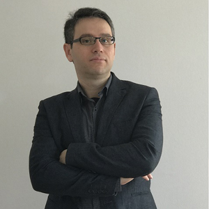
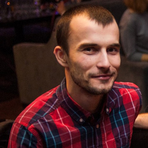
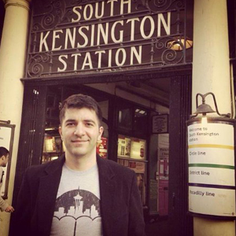
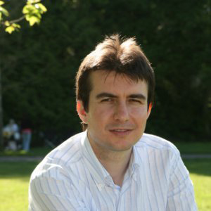




<!-- MASTHEAD -->

    

        

    	    <h3 class="swiper-header">{{ site.data.pages['page_ref_meet_the_leadership'].title[page.lang] }}</h3>
        

    

<!-- //MASTHEAD -->

	

    	<!-- MAIN CONTENT -->
    	

            

    	        <h1 class="page-title">{{ site.data.pages['page_ref_meet_the_leadership'].title[page.lang] }}</h1>
            

            

            <!-- Article -->
                <article itemscope itemtype="http://schema.org/Article">
	                <meta itemprop="inLanguage" content="en-GB" />
	                <meta itemprop="url" content="/deepnetwork/meet-the-leadership" />
	                <meta itemscope itemprop="mainEntityOfPage" itemtype="http://schema.org/WebPage"  itemid="/deepnetwork/meet-the-leadership" />
                    <meta content="2019-10-22T07:04:32+00:00" itemprop="dateModified">
                    <meta content="2019-04-04T19:29:36+00:00" itemprop="datePublished">
                    
                        Super User
                        
                            
                                
                                <meta content="auto" itemprop="width">
                                <meta content="auto" itemprop="height">
                            
                            <meta content="Super User" itemprop="name">
                        
                    
                    <!--e:Validate structured data-->
                	<meta content="Meet The Leadership" itemprop="headline">
    	            <section class="article-content clearfix" itemprop="articleBody">
    		            

                            

    	                        <h2>Savas Guven</h2>
    	                        
<em>Founder</em>

                                Savas’s career passion has been to bring to life technology solutions which boost the competiveness of businesses. As a co-founder of the company, he brings 19 years of experience in the software industry.
                                  
                                He has worked as a Developer for 17 years in Microsoft Corp, helping his customers realize their dreams for bringing the technology to the service of their businesses, in multiple countries, with a diverse set of industries. He began his professional life in the CyberSecurity business in Turkey and then joined the ranks of Microsoft Corp in Redmond, WA.
                                  
    	                        He holds a Master of Science in Computer Engineering from University of Southern California and a 4 USPO patents in Communication. You can always find him tinkering with the latest technologies.
                            

                            

                        

                        

                        

                            

		                        <h2>Igor Kliushnikov</h2>
		                        
<em>Partner</em>

                                Igor has 10+ years of software development experience. His passion is cloud technologies, highload distributed services, and robustness solutions.
                                  
                                During the career, he designed and developed new products from scratch, maintained large legacy codebase, managed distributed teams, introduced Agile practices into the work process
                                  
                                Igor got a Master degree in Computer Science in Kyiv Polytechnic Institute, Ukraine.
                                  
                                He tries to follow the latest technologies and practices closely.
                            

                            

                        

                        

                        

	                        

		                        <h2>Furkan Fidan</h2>
		                        
<em>Partner</em>

                                Furkan is a Full-Stack Developer with 12+ years of software development experience with 10 years at Microsoft both in Redmond headquarters and in London Office.
                                  
                                He has been Involved in all stages of the software development cycle from design to coding, planning to project management. Designed and implemented distributed services and APIs that can scale to support millions of queries a day and still perform within single digit milliseconds. Complemented these services with solutions such as daily deployments and live site monitoring for high quality and agile development lifecycle.
                                  
                                He has Maintained and improved large codebases of legacy products with more than 100k lines of source code under his responsibility. Implemented new features, integrated with other products, built interfaces to deliver e2e working solutions.
                                  
                                Lead other software developers form all ranges of experience, held scrums, managed planning and project roadmap. Owned various technical areas, worked as a gatekeeper and supported other developers with design and code reviews. Built pipelines for data ingestion, data normalization, analysis via machine learning that process petabytes of data and produce outputs with various schemas from XML to binary.
                            

                            

                        

                        

                        

	                        

		                        <h2>Giray Simsek</h2>
		                        
<em>Partner</em>

                                Giray’s career passion has been to bring technology solutions to life which boost the competitiveness of businesses. As a co-founder of the company, he brings along his 19 years of software product development experience both on Microsoft and Linux platforms.
                                  
                                He has worked as a software developer in the various enterprise software domains for many years. Working at Microsoft product development divisions for 11 years, he has contributed to products such as SQL Server, System Center Operations Manager (SCOM), System Center Service Manager (SCSM) and Axapta. Afterwards, he has played several roles ranging from software architect to project manager in smaller startup companies in the networking and cyber security domains. He designed and developed some of the critical components of a leading UTM product family. He founded a startup with the mission to develop IoT and image processing products. A Remote Water Quality Monitoring System and an Automatic Licence Plate Recognition System are among the latest products he developed.
                                  
                                He holds a Bachelor of Science degree in Computer Engineering and a Master of Science degree in Information Systems from Middle East Technical University.
                            

                            

                        

                    </section>
                </article>
                <!-- //Article -->
            

		

		<!-- //MAIN CONTENT -->
    

	    
  

