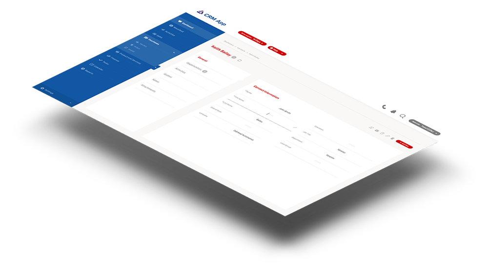
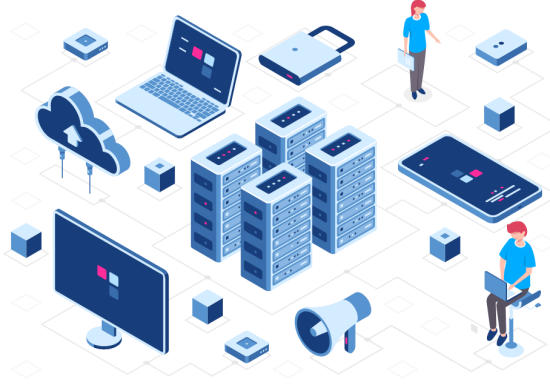
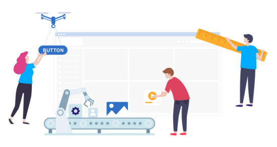




<!-- MASTHEAD -->

    

        

		    <h3 class="swiper-header">{{ site.data.pages['page_ref_our_solutions'].title[page.lang] }}</h3>
        

    

<!-- //MASTHEAD -->

	

		<!-- MAIN CONTENT -->
		

            

		        <h1 class="page-title">{{ site.data.pages['page_ref_our_solutions'].title[page.lang] }}</h1>
        	

            

                <!-- Article -->
                <article itemscope itemtype="http://schema.org/Article">
                    <meta itemprop="inLanguage" content="en-GB" />
                    <meta itemprop="url" content="/deepnetwork/our-solutions" />
                    <meta itemscope itemprop="mainEntityOfPage" itemtype="http://schema.org/WebPage"  itemid="/deepnetwork/our-solutions" />
                    <meta content="2019-10-22T07:01:07+00:00" itemprop="dateModified">
                    <meta content="2019-04-04T19:29:36+00:00" itemprop="datePublished">
                    
                        Super User
                        
                            
                                
                                <meta content="auto" itemprop="width">
                                <meta content="auto" itemprop="height">
                            
                            <meta content="Super User" itemprop="name">
                        
                    
                    <!--e:Validate structured data-->
                    <meta content="Our Solutions" itemprop="headline">
                    <section class="article-content clearfix" itemprop="articleBody">
                        

                            
                            Ultimate Low-Code Digital Transformation Platform
                              
                            
                        

                        

                        

                            

                                <h2>Meet the future of app development</h2>
                                PrimeApps enables rapidly creating powerful and beautiful business apps with drag-n-drop simplicity and packed with ready-to-use enterprise grade features.
                                  
                                Rapidly build cloud-first business apps and adapt your business to the speed of digital world.
                                <h3>Benefits</h3>
                                <ul>
                                    <li>Improved Agility</li>
                                    <li>Cost Reduction</li>
                                    <li>Productivity Boost</li>
                                    <li>Enhanced Customer Experience</li>
                                </ul>
                            

                            

                                
                            

                        

                        

                        

                            

                                
                            

                            

                                <h2>No coding skills required</h2>
                                Seriously: No code, no deployment, no hassle. But you have the freedom and flexibility to extend your app with the programming language of your choice;  
                                <ul>
                                    <li>JS/HTML</li>
                                    <li>C#</li>
                                    <li>JAVA</li>
                                    <li>Python</li>
                                    <li>NodeJS</li>
                                    <li>Ruby</li>
                                    <li>PHP</li>
                                    <li>GO</li>
                                </ul>
                            

                        

                        

                        

                            <h2 style="color: #acc91e;">Highlights</h2>
                             
                            

                                
                                    
                                <svg class="solutionicon"><use xlink:href="../images/sprite.svg#icon-cloud-upload"></use></svg>  
                                
 
                                <strong>Deployment</strong> 
                                Deploy your business app to any cloud with just a click.  
                            

                            

                                

                                <svg class="solutionicon"><use xlink:href="../images/sprite.svg#icon-magic"></use></svg>  
                                
 
                                <strong>Integrated</strong> 
                                Connect your business app to other third party services easily.  
                            

                            

                                

                                <svg class="solutionicon"><use xlink:href="../images/sprite.svg#icon-rocket"></use></svg>  
                                
 
                                <strong>Performance</strong> 
                                Regardless of your data and transaction size, built-in performance optimization logic ensures you have the fastest experience avaliable.  
                            

                            

                                

                                <svg class="solutionicon"><use xlink:href="../images/sprite.svg#icon-recycle"></use></svg>  
                                
 
                                <strong>Sustainability</strong> 
                                Benefit from the built-in Development, Testing, Acceptance and Production processes.  
                            

                            

                                

                                <svg class="solutionicon"><use xlink:href="../images/sprite.svg#icon-mobile"></use></svg>  
                                
 
                                <strong>Omni-Channel</strong> 
                                Unify development activities and build only one app for all devices.  
                            

                            

                                

                                <svg class="solutionicon"><use xlink:href="../images/sprite.svg#icon-archive"></use></svg>  
                                
 
                                <strong>Code-Agnostic</strong> 
                                Leverage your existing programming skills to make customizations fast and have the complete control.  
                            

                        

                    </section>
                </article>    
            
    
        

	

    

        

            

                <h2>Start Shaping the Future Now</h2>
                <a href="request-a-demo.html" class="btn btn-default">
                    {{ site.data.pages.general.request_a_demo[page.lang] }}
                </a>
            

        

    

  

