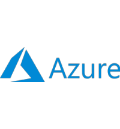
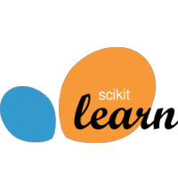
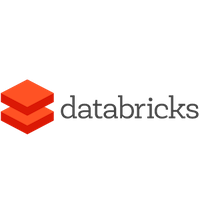
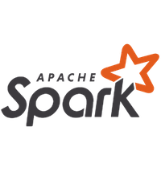
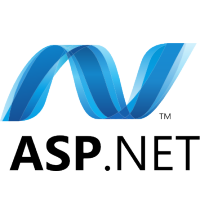
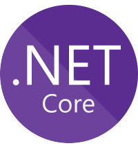
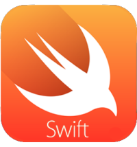
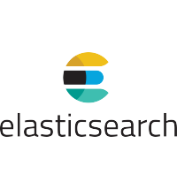
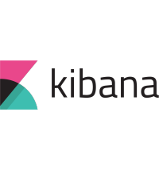
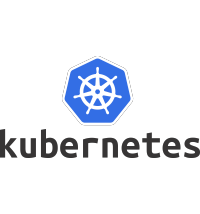




<!-- MASTHEAD -->

    

        

		    <h3 class="ja-masthead-title">Our Services</h3>
        

    
	

<!-- //MASTHEAD -->

    

		<!-- MAIN CONTENT -->
		

            

		        <h1 class="page-title">OUR SERVICES</h1>
	        

            

                <!-- Article -->
                <article itemscope itemtype="http://schema.org/Article">
                    <meta itemprop="inLanguage" content="en-GB" />
                    <meta itemprop="url" content="/deepnetwork/our-services" />
                    <meta itemscope itemprop="mainEntityOfPage" itemtype="http://schema.org/WebPage"  itemid="/deepnetwork/our-services" />
                    <meta content="2020-01-01T10:00:00+00:00" itemprop="dateModified">
                    <meta content="2019-04-10T08:23:45+00:00" itemprop="datePublished">
                    
                        Super User
                        
                            
                                
                                <meta content="auto" itemprop="width">
                                <meta content="auto" itemprop="height">
                            
                            <meta content="Super User" itemprop="name">
                        
                    
                    <!--e:Validate structured data-->	
                    <meta content="Our Services" itemprop="headline">
                    <section class="article-content clearfix" itemprop="articleBody">
                        

                            <h2>Vision</h2>
                            We live in an age where software is ubiquitous. Every company from every industry now has to leverage software one way or another to stay in the ever-competitive game. There is almost no problem that cannot be made easier if not outright solved with the help of computers and software.
                              
                            Even though there are many ways of slicing software stack, we prefer to group our solutions into three distinct layers: data, apps, and services; and we complement these with devops and security services.
                              
                            <h2>Data</h2>
                            Rise of the software with its reach into every aspect of the business together with the advancements in networking meant one thing: more data. More data not only because we can have access to more data but now we can do more with data.
                             
                             
                            We can help you make the most out of your data:
                            <ul>
                                <li>Data collection from your own or 3rd party apps and services.</li>
                                <li>Data Visualisations and dashboards to present your data in a meaningful way via Azure and PowerBI.</li>
                                <li>Data Visualisations on the web via frameworks like D3.js.</li>
                                <li>Data processing pipelines on various platforms including Azure via ADLA/U-SQL, Databricks, Sql Warehouse to better analyze your data.</li>
                                <li>Machine learning model training for Classification & Regression problems, deployment and management as a service.</li>
                                <li>DB Operations: Microsoft SQL Server, PostgreSQL (deploy, scale, maintain, design)</li>
                            </ul>
                             
                            

                                

                                    
                                

                                

                                    
                                

                                

                                    
                                

                                

                                    
                                

                                

                                    
                                

                                

                                    
                                

                                

                                    
                                

                                

                                    
                                

                                

                                    
                                

                            
		
                             
                            <h2>Apps</h2>
                            The term ‘App’ has made its way to popular lexicon with the rise of the mobile applications but the concept Itejhas been around for many years before. Apps are the face of your products. We have many years of experience building apps to cater various solutions and for many types of users. 
                              
                            <ul>
                                <li><strong>Desktop:</strong> Windows & MacOSS Native Apps</li>
                                <li><strong>Mobile:</strong> Android & Safari</li>
                                <li><strong>Web:</strong> SPA, ASP.Net/MVC, Java/Spring</li>
                            </ul>
                             
                            

                                

                                      
                                

                                

                                      
                                

                                

                                      
                                

                                

                                      
                                

                                

                                      
                                

                                

                                      
                                

                                

                                      
                                

                                

                                      
                                

                            

                              
                            <h2>Services</h2>
                            The backbone of all successful apps is high quality services. Services, also can stand on their own to enable 3rd party scenarios. We can build fast and performant, highly reliable, and secure services available through any online platform. 
                            
                            <h3>Distributed Systems</h3>
                            Highly scalable and reliable distributed systems for your services.
                            <ul>
                                <li>Microservices built on Kubernetes, the de facto orchestration solution.</li>
                                <li>Most advanced operations & management stack:</li>
                                <ul>
                                    <li>Logging pipeline for ease of debugging, rela time issue investigation via EFK stack.</li>
                                    <li>Monitoring and alerting solution to increase uptime, detect issues early on via Prometheus & Grafana.</li>
                                    <li>Tracing and network level monitoring for in depth understanding of data flow via Jaeger & istio</li>
                                </ul>
                            </ul>
                            <h3>Cloud Migration / Digitalisation</h3>
                            Migrate your existing solutions to cloud stack powered by Azure, Amazon, or Google to increase reliability while reducing the cost of operation. Enable much richer experiences by taking advantage of the latest tech with very little hassle.
                            <ul>
                                <li>Bridge your internal network with cloud to migrate your solution in multiple stages without interruption.</li>
                                <li>Carry over your solutions to various cloud services (IaaS, PaaS, SaaS) to reduce management overhead.</li>
                                <li>Build cloud provider independent solutions to maximize flexibility.</li>
                            </ul>
                              
                            <h2>DevOps</h2>
                            We can help you fully automate your systems to embrace agile development and lower cost of release management. 
                            <ul>
                                <li>CI/CD pipelines on various platforms like Azure DevOps and Jenkins to reliably deliver your products.</li>
                                <li>Testing at various stages of your system to always deliver high quality products, catch issues early on and automate reporting to increase visibility and predictability.</li>
                                <li>Integrate various 3rd party scanners to your pipelines to automatically catch security vulnerabilities in your cluster.</li>
                                <li>Manage 3rd party components in your system such as Elasticsearch, Kibana, Prometheus for high reliability so that you can focus on your business logic.</li>
                            </ul>
                            

                                

                                      
                                

                                

                                      
                                

                                

                                      
                                

                                

                                      
                                

                                

                                      
                                
                            
                            

                        
		
                    </section>
                </article>
            

        

    

 

  

